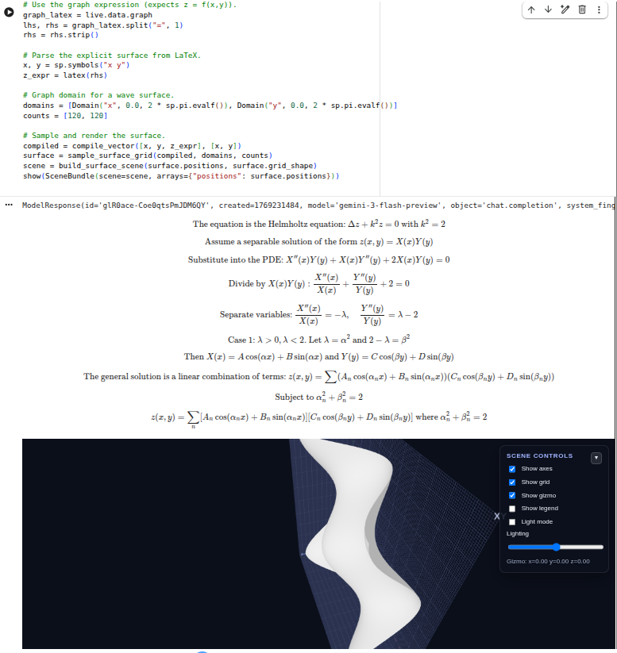

# Geometrix

LLM-assisted LaTeX-first differential geometry renderer for Jupyter/Colab. Ask for
symbolic solutions (with full derivations), then graph them immediately.

## Flagship: LLM → Graph

_From `examples/14_llm_assist2.py`._

```python
import sympy as sp
from google.colab import userdata
from geometrix import llm_solve, latex, show
from geometrix.api import SceneBundle
from geometrix.sample.domains import Domain
from geometrix.sample.surface import sample_surface_grid
from geometrix.scene.build import build_surface_scene
from geometrix.symbolic.compile import compile_vector
from geometrix.symbolic.llm import LLMConfig

config = LLMConfig(
    provider="gemini",
    model="gemini-3-flash-preview",
    api_key=userdata.get("GEMINI_API_KEY"),
)
live = llm_solve(
    "x^2 + y^2 + z^2 = 1",
    config=config,
    response_type="full",
    wants_graph=True,
    graph_dim=3,
)

graph_latex = live.data.graph  # e.g., "z = \\sqrt{1-x^2-y^2}"
_, rhs = graph_latex.split("=", 1)
x, y = sp.symbols("x y")
z_expr = latex(rhs.strip())

domains = [Domain("x", -1.0, 1.0), Domain("y", -1.0, 1.0)]
compiled = compile_vector([x, y, z_expr], [x, y])
surface = sample_surface_grid(compiled, domains, [80, 80])
scene = build_surface_scene(surface.positions, surface.grid_shape)
show(SceneBundle(scene=scene, arrays={"positions": surface.positions}))
```

LaTeX-first differential geometry renderer for Jupyter/Colab. Write math in LaTeX,
sample it numerically, and render with an interactive Three.js viewer.

## Install
```bash
pip install geometrix
```

## Quickstart (Notebook)
```python
from geometrix import geom

scene = geom("""
coords: u v
X(u,v) = (u, v, 0)
render: surface X domain u:[0,1] v:[0,1] res 30 30
""")
scene.show()
```

## LaTeX-First Workflow
```python
import sympy as sp
from geometrix import latex, show
from geometrix.api import SceneBundle
from geometrix.sample.domains import Domain
from geometrix.sample.surface import sample_surface_grid
from geometrix.scene.build import build_surface_scene
from geometrix.symbolic.compile import compile_vector

u, v = sp.symbols("u v")
x = latex("u", show_latex_expr=True)
y = latex("v", show_latex_expr=True)
z = latex("\\sin(u)\\cos(v)", show_latex_expr=True)

compiled = compile_vector([x, y, z], [u, v])
surface = sample_surface_grid(
    compiled,
    [Domain("u", -sp.pi.evalf(), sp.pi.evalf()), Domain("v", -sp.pi.evalf(), sp.pi.evalf())],
    [60, 60],
)
scene = build_surface_scene(surface.positions, surface.grid_shape)
show(SceneBundle(scene=scene, arrays={"positions": surface.positions}))
```

## Viewer Controls
- Toggle axes, grid, gizmo, legend, and light mode.
- Drag gizmo arrow tips to move the locator; coordinates update in the panel.
- Grid planes and tick labels adapt to the data range.

## Input Types
- LaTeX expressions via `latex()` (math-first workflow).
- DSL blocks via `geom(...)` for quick parametric surfaces.
- Python arrays for points/lines/meshes (via `points()`, `line()`, `mesh()`).

## Symbolic Utilities
```python
import sympy as sp
from geometrix import canonicalize, simplify, solve

x = sp.symbols("x")
expr = (x**2 - 1) / (x - 1)
print(canonicalize(expr))
print(simplify(expr, mode="factor"))
print(solve([x**2 - 1], [x], dict=True))
```

## Coordinate Helpers
```python
import numpy as np
from geometrix import cylindrical_to_cartesian, spherical_to_cartesian, lorentz_metric

r, theta, z = np.array([1.0]), np.array([0.5]), np.array([0.0])
xyz = cylindrical_to_cartesian(r, theta, z)
metric = lorentz_metric()
```

## Notes
- LaTeX parsing uses a safe allowlist of commands; unknown commands are rejected.
- Indices use the symbols `i, j, k, l, m, n, a, b, c, d` by default.
- The HTML renderer loads Three.js from a CDN (no widget install needed).

## Examples
See `examples/` for points, lines, surfaces, DSL, and LaTeX demos.
